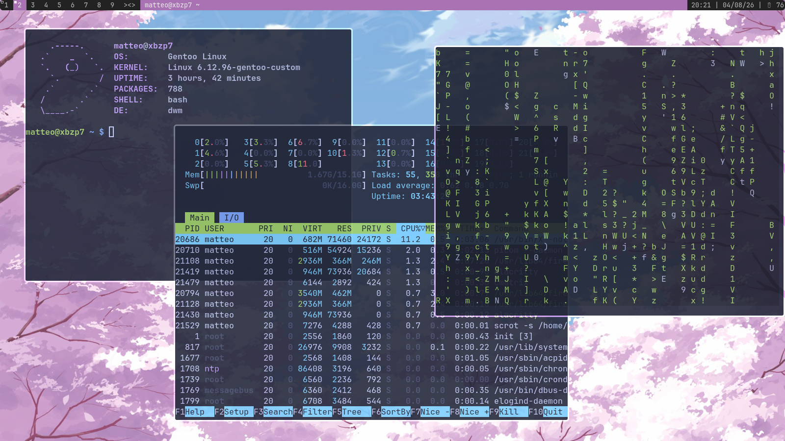

## Preview



Requirements
------------
In order to build dwm you need the Xlib header files.
- feh
- scrot
- xorg
- alacritty
- dmenu
- picom
- pulseaudio

Installation
------------
```
cp ~/mdwm/scripts/.xinitrc ~/
cd ~/mdwm
sudo make clean install
```


